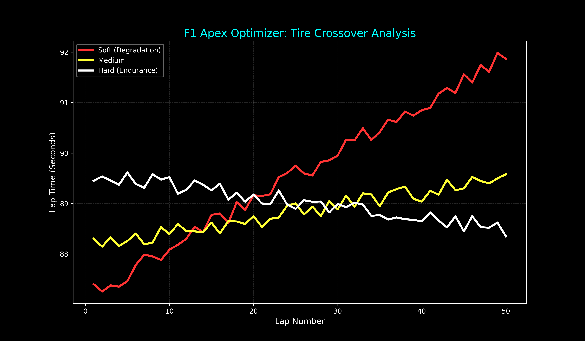

# Apex Pit Optimizer: F1 Race Strategy Simulator

A Python-based discrete-event simulation engine that models Formula 1 race dynamics. This tool uses **Object-Oriented Programming (OOP)** to simulate the interplay between tire degradation, fuel weight penalties, and pit stop timing to determine optimal race strategies.

## 🚀 Key Features
- **Dynamic Performance Modeling:** Lap times are calculated using a multi-variable linear model factoring in base car pace, tire compound modifiers, and fuel-load weight.
- **Automated Strategy Optimizer:** Features a brute-force search algorithm that iterates through every possible pit window to identify the mathematically optimal strategy.
- **Stochastic Variance:** Uses Gaussian-style randomness to simulate driver inconsistency and varying track conditions.
- **Data Visualization:** Integrated `matplotlib` telemetry dashboard to graph crossover points and performance "cliffs" across different tire compounds.
- **Containerized Environment:** Fully Dockerized with graphics support to ensure platform-agnostic execution and reproducible results.
- **Data Persistence:** Automatically logs every lap of the race—including tire compound, pace, and wetness—into a `.csv` file for post-race telemetry analysis.
- **Tire Degradation Modeling:** Simulates non-linear grip loss and thermal degradation (shredding) of wet tires on dry surfaces.

## 🛠️ Technical Concepts Applied

### Object-Oriented Programming (OOP)
The project is built on the encapsulation of states. The `RaceCar` class maintains its own fuel and timing data, while the `Tire` class manages its own degradation metrics. This modularity allows for easy expansion (e.g., adding a `Track` class or `Weather` effects).

### Brute-Force Optimization
The Strategy Optimizer implements a search algorithm that runs independent race simulations for every possible pit lap. By recording the `total_time` for each permutation, the program identifies the "Global Minimum"—the pit lap that results in the fastest race completion.

### Containerization & Volumes
The application is encapsulated within a **Docker** container. To handle the visualization engine, the Dockerfile includes system-level dependencies for font rendering. **Volume Mapping** is utilized to export generated telemetry plots from the isolated container to the host machine.

### Mathematical Modeling
The simulation uses the following formulas to bridge the gap between physical variables and race time:

**1. Tire Wear Penalty**
> $$Time_{penalty} = (100 - \text{life}) \times \text{decay rate}$$

**2. Fuel Weight Penalty**
> $$Time_{penalty} = \text{fuel mass} \times 0.03s/kg$$

**3. Stochastic Factor**
> $$Lap_{time} = \text{Base} + \text{Penalties} + \text{Random}(-0.1, 0.3)$$

## 📦 Installation & Usage

### Option 1: Standard Python
1. **Install dependencies:**
   ```bash
   pip install -r requirements.txt

2. **Run the simulation:**
   ``python main.py

**Option 2: Docker (Recommended)**

   Build the image:
    
    Bash
    docker build -t f1-sim .

   Run the container:
    
    Bash
    docker run -v .:/app f1-sim

## 📊 SAMPLE OUTPUT

--- Strategy Team: Calculating Optimal Window ---
SUGGESTED STRATEGY: Pit on Lap 24 for a projected 4120.45s total.

--- 50 Lap Race Start ---
LAP 10
Merc Pace: 842.15s | Fuel: 102.0kg
RB Pace: 845.30s | Fuel: 102.0kg

--- Kimi Antonelli is BOXING ---
...
The winner is Mercedes!



## Tracks & Future Roadmap

[ ] Multi-Car Grid: Expand the simulation to handle 20+ cars with overtaking logic and "dirty air" penalties.
